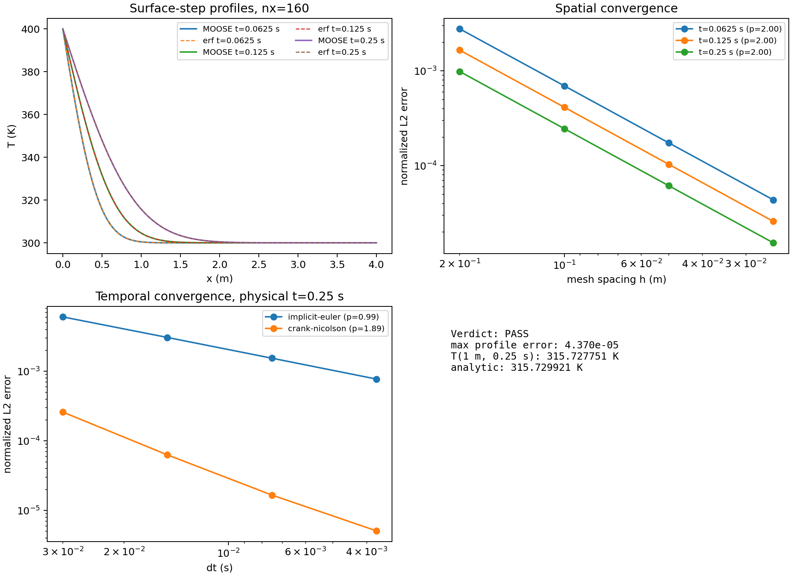
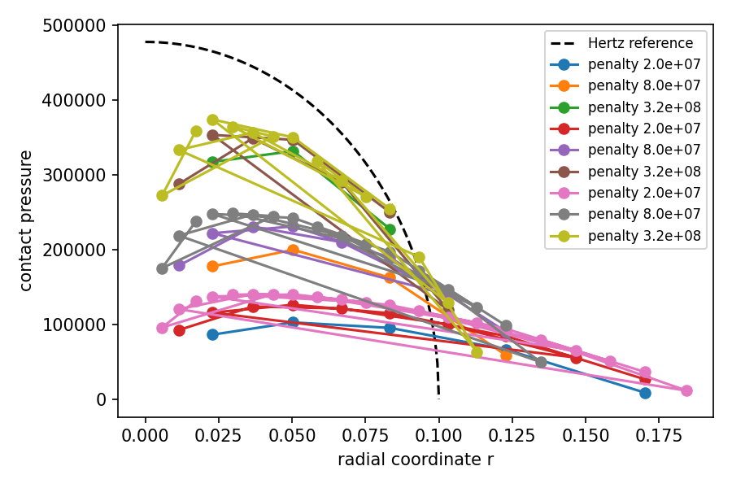

# MOOSE Multiphysics Capability Verification Suite

25 [MOOSE](https://mooseframework.inl.gov/) finite-element simulations spanning nine physics domains.
Each one is checked against a closed-form solution, a published numerical benchmark, or a code-to-code
reference, with the reference, metric and tolerance **declared before the first successful solve**.

**Result: 25 / 25 cases pass.** The full table is in [RESULTS.md](RESULTS.md), the write-up is in
[paper/verification.pdf](paper/verification.pdf), and there is a browsable report at
[docs/report.html](docs/report.html).

## Cases

| Tier | Case | Capability | Reference | Scored error | Tol. |
|---|---|---|---|---:|---:|
| 1 | T1-01 | Transient heat conduction | analytic series | 6.9e-6 | 2e-3 |
| 1 | T1-02 | Fickian species diffusion | analytic series | 5.6e-5 | 2e-3 |
| 1 | T1-03 | Convective + radiative BCs | fin / lumped analytic | 3.4e-4 | 1e-2 |
| 1 | T1-04 | Reaction–diffusion | analytic, 3 regimes | 1.9e-6 | 5e-3 |
| 1 | T1-05 | J2 elastoplastic thick cylinder | limit pressure | 5.5e-3 | 2e-2 |
| 1 | T1-06 | Power-law creep | analytic strain | 2.2e-4 | 1e-2 |
| 1 | T1-07 | Plane Poiseuille flow | analytic profile | 1.7e-3 | 2e-2 |
| 1 | T1-08 | Hertzian contact | Hertz p₀ and a | 7.6e-4 | 3e-2 |
| 1 | T1-09 | Cahn–Hilliard coarsening | t^(1/3) slope | 0.026 (abs.) | 0.05 |
| 1 | T1-10 | Allen–Cahn grain growth | R² ∝ t | 3.7e-5 | 1e-3 |
| 1 | T1-11 | One-group diffusion eigenvalue | bare-slab closed form | 4.0e-4 | 1e-3 |
| 1 | T1-12 | Stochastic tools / Sobol indices | analytic Ishigami | 0.011 | 0.03 |
| 2 | T2-13 | Lid-driven cavity, Re = 1000 | Ghia et al. (1982) | 0.020 | 0.04 |
| 2 | T2-14 | Natural convection, Ra 10³–10⁶ | de Vahl Davis (1983) | 0.038 | 0.04 |
| 2 | T2-15 | Conjugate heat transfer | analytic Nusselt | 1.0e-4 | 2e-2 |
| 2 | T2-16 | Darcy flow / Theis drawdown | Theis solution | 0.011 | 0.02 |
| 2 | T2-17 | Fracture J-integral | NAFEMS R0020 | 3.6e-3 | 3e-2 |
| 2 | T2-18 | Finite-strain rigid rotation | zero-stress invariant | 1.9e-14 | 1e-8 |
| 2 | T2-19 | TAO inverse source recovery | manufactured source | 2.6e-4 | 1e-3 |
| 2 | T2-20 | Neutronics-shaped heat source | closed form | 1.8e-10 | 1e-2 |
| 2 | T2-21 | Stefan melting problem | similarity solution | 2.9e-3 | 2e-2 |
| 3 | T3-22 | Euler buckling (Southwell) | Euler load | 1.8e-4 | 3e-2 |
| 3 | T3-23 | Irradiation swelling eigenstrain | closed-form stress | 7.3e-5 | 1e-3 |
| 3 | T3-24 | Fluid–structure interaction | Turek & Hron FSI1 | 6.8e-3 | 0.1 |
| 3 | T3-25 | Dendritic growth-direction selection | imposed anisotropy | 0.17° | 2° |

Validation classes: **[A]** verification against a closed form or invariant, **[B]** benchmark or
code comparison, **[E]** experiment. The suite is honest about the distinction. It has no [E] rows,
and cases that substitute for unavailable inputs (for example, irradiation swelling without a
source-backed material law) say so in their `reference.json`.

## Method

Every case directory under `cases/` follows the same contract ([SCHEMA.md](SCHEMA.md)):

| File | Purpose |
|---|---|
| `reference.json` | reference value, its provenance, the scored metric and tolerance, committed before solving |
| `*.i` | MOOSE input files, usually a mesh or timestep sweep |
| `run.sh` | runs the solves and the verifier from a clean `out/` |
| `verify.py` | extracts the MOOSE quantity, computes the error, writes `result.json` |
| `result.json` | verdict, error, observed convergence order, runtime, limitations |
| `figures/` | convergence and comparison plots |

Analytic cases include mesh or timestep refinement with observed convergence orders. Tolerances are
never changed after the fact, and PASS / FAIL / PARTIAL / BLOCKED are all legitimate outcomes.

<p align="center">
  
  
</p>

## Requirements

- MOOSE `combined-opt` (built with the heat_transfer, solid_mechanics, navier_stokes, phase_field,
  porous_flow, stochastic_tools, optimization, fsi, contact, xfem and fluid_properties modules;
  `check_env.py` checks for all of them)
- MPICH `mpiexec` matching the MOOSE build
- Python 3 with numpy, scipy, matplotlib, pandas, sympy, h5py, meshio

Set the paths in [env.sh](env.sh). Each can be overridden by an environment variable.
[ENVIRONMENT.md](ENVIRONMENT.md) documents the verified setup and its pitfalls.

## Usage

```bash
source env.sh
$PY check_env.py                                       # toolchain preflight
bash cases/T1-01_transient_heat_conduction/run.sh      # run and score a single case
$PY run_all.py --skip-run                              # regenerate RESULTS.md and data/summary.csv
make -C paper                                          # rebuild the paper (requires latexmk)
```

Most cases run in seconds to minutes. T1-09, T2-13, T3-24 and T3-25 take hours.

## Repository layout

```
cases/        25 self-contained case directories
data/         summary.csv, generated from the case results
paper/        LaTeX source and PDF of the verification write-up
docs/         HTML report
PLAN.md       case definitions, reference sources, acceptance criteria and risk tiers
CHECKLIST.md  the capability checklist the suite implements
SCHEMA.md     per-case file contract
run_all.py    aggregates every result.json into RESULTS.md
```

## Acknowledgements

Benchmark data: Ghia, Ghia & Shin (1982); de Vahl Davis (1983); Turek & Hron (2006); NAFEMS R0020. AI coding
assistants were used to help with implementation and to independently check results.

## License

MIT. See [LICENSE](LICENSE).
